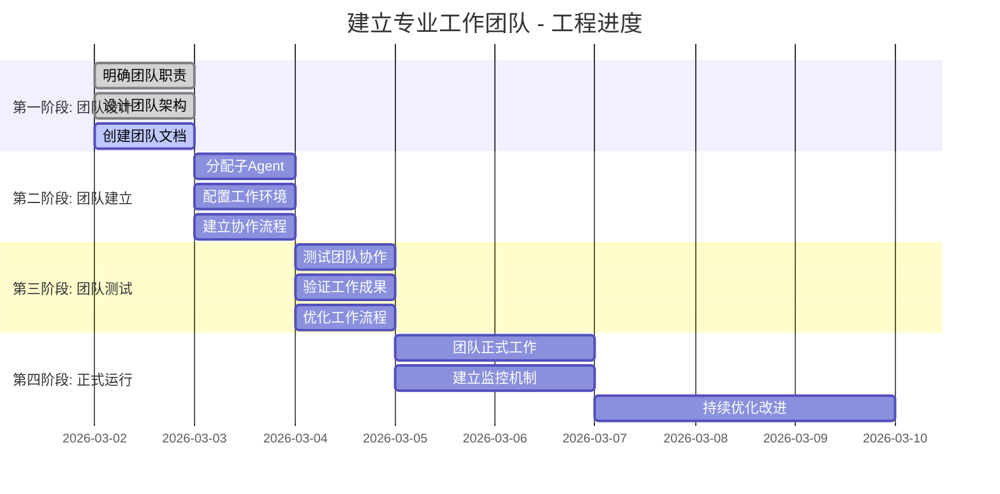

# 📈 工程进度 - 建立专业工作团队

## 🎯 工程概况
- **工程ID**: ENG_20260302_建立专业团队
- **工程名称**: 建立专业工作团队
- **项目经理**: 虾BB
- **开始时间**: 2026-03-02 19:06 GMT+8
- **当前阶段**: 第一阶段 - 团队设计

## 📊 进度概览

### 总体进度

### 当前状态
- **总体进度**: 25%
- **当前阶段**: 第一阶段 - 团队设计
- **阶段进度**: 66%
- **预计完成**: 2026-03-03

## 📋 阶段详情

### 第一阶段：团队设计 (进行中，进度66%)
**目标**: 明确团队职责，设计团队架构，创建团队文档

#### ✅ 已完成
1. **明确团队职责** (100%)
   - 定义了3个团队的职责范围
   - 明确了每个团队的具体工作
   - 确定了技能要求和工作标准

2. **设计团队架构** (100%)
   - 设计了3个专业团队架构
   - 建立了团队协作关系
   - 规划了工作流程和工具

#### 🔄 进行中
3. **创建团队文档** (50%)
   - ✅ 创建了工程README.md
   - ✅ 创建了代码专家团队文档
   - ✅ 创建了书记员团队文档
   - ✅ 创建了检查员团队文档
   - 🔄 创建团队协作流程文档
   - 🔄 创建团队绩效指标文档

#### 📅 待完成
4. **完善团队设计** (0%)
   - 设计团队沟通机制
   - 制定团队工作标准
   - 创建团队培训材料

### 第二阶段：团队建立 (待开始，进度0%)
**目标**: 分配子Agent，配置工作环境，建立协作流程

#### 计划任务
1. **分配子Agent** (0%)
   - 从AGENTS_REGISTRY.md选择合适Agent
   - 分配团队负责人和成员
   - 明确团队职责和权限

2. **配置工作环境** (0%)
   - 配置团队工作目录
   - 设置必要工具和环境
   - 建立文件管理和版本控制

3. **建立协作流程** (0%)
   - 建立团队内部协作流程
   - 建立团队间协作流程
   - 建立问题解决和升级流程

### 第三阶段：团队测试 (待开始，进度0%)
**目标**: 测试团队协作效果，验证工作成果质量，优化工作流程

### 第四阶段：正式运行 (待开始，进度0%)
**目标**: 团队正式投入工作，建立绩效监控机制，定期团队优化

## 🎯 里程碑

### 已达成里程碑
1. ✅ **工程启动** (2026-03-02 19:06)
   - 工程正式启动
   - 创建工程文件夹
   - 明确工程目标

2. ✅ **团队职责明确** (2026-03-02 19:07)
   - 明确了3个团队的职责
   - 设计了团队架构
   - 创建了初步文档

### 计划里程碑
3. 🔄 **团队设计完成** (预计: 2026-03-02)
   - 完成所有团队文档
   - 建立团队协作流程
   - 制定团队工作标准

4. 🔄 **团队建立完成** (预计: 2026-03-03)
   - 分配完成所有子Agent
   - 配置完成工作环境
   - 建立完成协作流程

5. 🔄 **团队测试完成** (预计: 2026-03-04)
   - 完成团队协作测试
   - 验证工作成果质量
   - 优化工作流程

6. 🔄 **工程正式完成** (预计: 2026-03-05)
   - 团队正式投入工作
   - 建立绩效监控机制
   - 完成工程总结报告

## 📊 绩效指标

### 工程绩效
| 指标 | 目标 | 当前 | 状态 |
|------|------|------|------|
| 按时完成率 | 100% | 25% | 🟡 进行中 |
| 质量达标率 | ≥95% | 待评估 | ⚪ 未评估 |
| 资源使用率 | ≤100% | 待评估 | ⚪ 未评估 |
| 客户满意度 | ≥90% | 待评估 | ⚪ 未评估 |

### 团队绩效
| 团队 | 建立进度 | 文档完整 | 人员配备 | 总体状态 |
|------|----------|----------|----------|----------|
| 代码专家 | 50% | 80% | 0% | 🟡 设计中 |
| 书记员 | 50% | 80% | 0% | 🟡 设计中 |
| 检查员 | 50% | 80% | 0% | 🟡 设计中 |

## ⚠️ 风险与问题

### 当前风险
1. **团队设计不完善** (中风险)
   - **描述**: 团队设计可能不够详细
   - **影响**: 影响后续团队建立
   - **缓解**: 加强设计审查，邀请搭档参与

2. **子Agent匹配困难** (中风险)
   - **描述**: 可能找不到合适的子Agent
   - **影响**: 团队建立延迟
   - **缓解**: 准备备用方案，考虑新建Agent

3. **协作流程不顺畅** (低风险)
   - **描述**: 团队协作可能存在问题
   - **影响**: 工作效率降低
   - **缓解**: 设计清晰的协作流程，定期优化

### 已解决问题
1. ✅ **职责范围明确**
   - **问题**: 团队职责不够清晰
   - **解决**: 详细定义了每个团队的职责
   - **结果**: 职责清晰，工作范围明确

## 🚀 下一步行动

### 今日计划 (2026-03-02)
1. 🔄 **完成团队设计** (优先级: 高)
   - 完善所有团队文档
   - 建立团队协作流程
   - 制定团队工作标准

2. 🔄 **开始团队建立准备** (优先级: 中)
   - 审查AGENTS_REGISTRY.md
   - 准备子Agent分配方案
   - 配置工作环境模板

### 明日计划 (2026-03-03)
1. 🔄 **完成团队建立** (优先级: 高)
   - 分配所有子Agent
   - 配置完成工作环境
   - 建立完成协作流程

2. 🔄 **开始团队测试** (优先级: 中)
   - 设计测试方案
   - 准备测试任务
   - 开始初步测试

## 📝 更新记录

| 更新时间 | 更新内容 | 更新人 |
|----------|----------|--------|
| 2026-03-02 19:16 | 更新AGENTS_REGISTRY.md，添加专业团队 | 虾BB |
| 2026-03-02 19:09 | 创建工程进度文件，更新进度 | 虾BB |
| 2026-03-02 19:08 | 创建团队文档，建立文件夹结构 | 虾BB |
| 2026-03-02 19:07 | 明确团队职责，设计团队架构 | 虾BB |
| 2026-03-02 19:06 | 工程启动，创建工程文件夹 | 虾BB |

---

**工程状态**: 进行中  
**当前阶段**: 第一阶段 - 团队设计  
**阶段进度**: 66%  
**总体进度**: 25%  
**项目经理**: 虾BB  
**最后更新**: 2026-03-02 19:09  
**下次更新**: 今天完成团队设计
